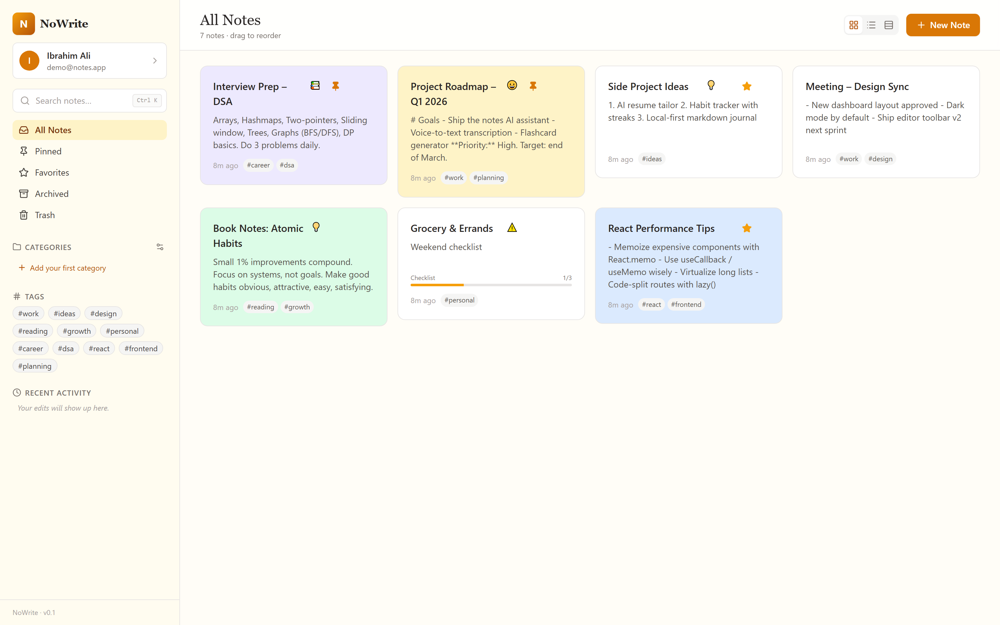

# NoWrite

> An AI-powered rich-text notes app — write, organize, and study smarter with a TipTap editor and Groq-driven helpers.


NoWrite is a full-stack MERN notes application with a distraction-free rich-text editor built on TipTap. Beyond classic note-taking — categories, tags, pinning, favorites, archiving, checklists, and colors — it layers in Groq-powered AI helpers that suggest titles and tags, generate flashcards and quizzes from your notes, and transcribe voice memos into text. Notes are drag-and-drop reorderable, JWT authentication keeps them private, and the backend is covered by a Mocha/Chai test suite.

<p align="center">
  
</p>

## ✨ Features

- 📝 **Rich-text editor** powered by TipTap — headings, links, highlight, underline, text alignment, and placeholders
- 🗂️ **Organize notes** with categories, tags, pin, favorite, and archive states
- ✅ **Checklists** inside notes with an inline checklist editor
- 🎨 **Customization** — note colors, fonts, and mood pickers
- 🔀 **Drag-and-drop reordering** of notes via dnd-kit
- 🤖 **AI helpers (Groq)** — suggest title & tags, generate flashcards, and build quizzes
- 🎙️ **Voice notes** — record audio and transcribe it to text with Groq
- 🧠 **Study mode** — flashcard decks and a quiz runner generated from your notes
- 🔍 **Search** with live suggestions
- 🔐 **JWT authentication** — register, login, and protected routes
- 👤 **User profile** with avatar upload (served from `/uploads`)
- 🌗 **Light / dark theme** with a theme context
- 💾 **Auto-save** indicator while editing
- 🧪 **Tested backend** — Mocha, Chai, Sinon, Supertest, and in-memory MongoDB with coverage via c8

## 🛠️ Tech Stack

**Frontend:** React 19, Vite 8, Tailwind CSS 3, TipTap (StarterKit + extensions), dnd-kit, React Router 7, Axios, lucide-react

**Backend:** Node.js, Express 5, MongoDB with Mongoose, JSON Web Tokens, bcryptjs, Multer (uploads), Groq SDK, Pino / pino-http logging

**AI:** Groq API — title/tag suggestions, flashcards, quizzes, and voice transcription

**Testing:** Mocha, Chai, Sinon, Supertest, mongodb-memory-server, c8

## 🚀 Getting Started

### Prerequisites

- Node.js 18+ and npm
- A MongoDB database (local or Atlas)
- A Groq API key (for AI and voice features)

### Installation

```bash
# Clone the repository
git clone <your-repo-url>
cd ibrahim-ali-mern-10pshine

# Install backend dependencies
cd backend
npm install

# Install frontend dependencies
cd ../frontend
npm install
```

### Environment Variables

Create a `.env` file in `backend/`:

```env
MONGO_URI=your_mongodb_connection_string
JWT_SECRET=your_jwt_secret
GROQ_API=your_groq_api_key
PORT=5000
CORS_ORIGIN=http://localhost:5173
LOG_LEVEL=info
```

Create a `.env` file in `frontend/`:

```env
VITE_API_BASE_URL=http://localhost:5000/api
VITE_API_ORIGIN=http://localhost:5000
```

### Running Locally

```bash
# Terminal 1 — backend (runs on http://localhost:5000)
cd backend
npm start
npm test             # optional: run the Mocha/Chai suite
npm run test:coverage

# Terminal 2 — frontend (Vite dev server on http://localhost:5173)
cd frontend
npm run dev
```

Then open **http://localhost:5173** in your browser.

## 📁 Project Structure

```
ibrahim-ali-mern-10pshine/
├── backend/
│   ├── configs/          # db, groq, logger
│   ├── controllers/       # note, category, ai, voice, user controllers
│   ├── middlewares/       # auth, upload
│   ├── models/            # User, Note, Category
│   ├── routes/            # notes, categories, ai, voice, users
│   ├── tests/             # Mocha/Chai/Sinon test suite
│   ├── uploads/           # user-uploaded avatars
│   └── server.js          # Express entry (port 5000)
├── frontend/
│   ├── src/
│   │   ├── pages/         # NotesPage, ProfilePage
│   │   ├── components/     # editor, customization, smart, study, voice, cards
│   │   ├── context/        # AppProvider, ThemeProvider
│   │   ├── router/         # ProtectedRoute, AuthRoutes
│   │   ├── App.jsx
│   │   └── main.jsx
│   └── vite.config.js
└── preview.png
```

---

<p align="center">Built by <b>Syed Ibrahim Ali</b> — Full-Stack &amp; AI Engineer</p>
